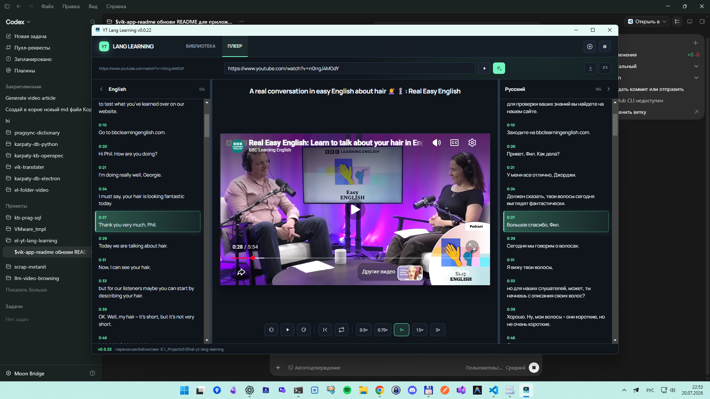
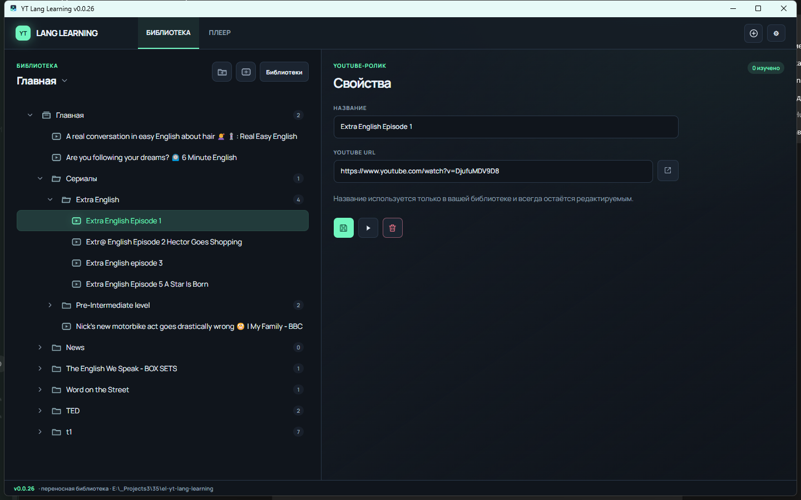
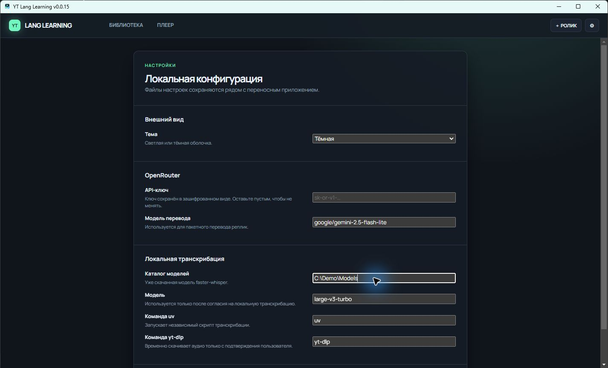
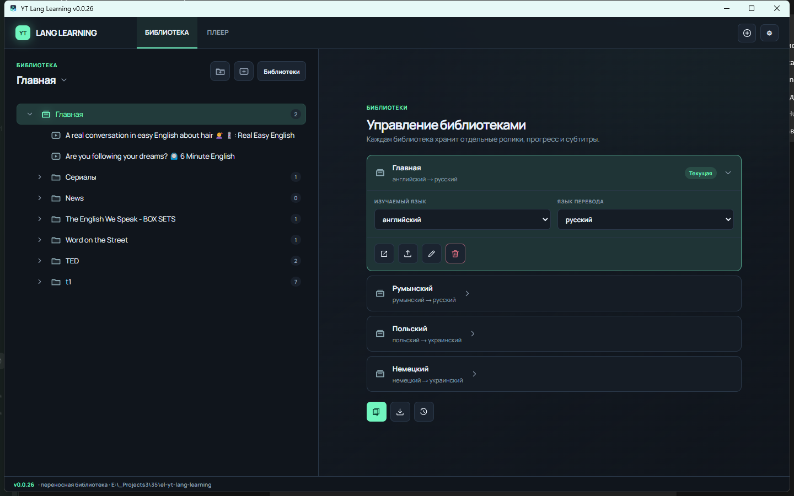

# YT Lang Learning

[English](README.md) | Українська

Перетворюйте YouTube-ролики на навчальні матеріали: відео, субтитри мови, яку вивчаєте, і переклад в одному вікні. Мовну пару можна обрати для кожної бібліотеки й окремо для конкретного ролика.

## Інтерфейс

<table>
  <tr>
    <td></td>
    <td></td>
  </tr>
  <tr>
    <td colspan="2"></td>
  </tr>
</table>

## Можливості

- Збирайте уроки в папки й міняйте порядок по ходу навчання.
- Клацніть на субтитр — перейдете до репліки. Повторюйте фразу, перемотуйте на п'ять секунд, міняйте швидкість.
- Вибирайте мову, яку вивчаєте, та мову перекладу: англійська, німецька, польська, українська та інші мови Whisper.
- Спочатку використовуйте готову доріжку або машинний переклад YouTube; якщо YouTube не віддає її або відповідає 429, використовуйте OpenRouter або локальний faster-whisper.
- Обмежте швидкий вибір списком «Мої мови», зберігши доступ до повного каталогу через пункт «Інша мова…».
- Імпортуйте відео з плейлиста YouTube. Дублікати пропускаються, застосунок запитує підтвердження перед додаванням.
- Експортуйте бібліотеку в JSON, імпортуйте наявну або відновіть останню резервну копію.
- Перемикайтеся між темною та світлою темами, вибирайте модель OpenRouter для перекладу.
- Транскрибуйте локальні медіафайли — не лише ролики YouTube, а й аудіо чи відео на вашому комп'ютері.

Застосунок запам'ятовує позицію кожного ролика. Бібліотека, налаштування та субтитри залишаються на вашому комп'ютері.

## Встановлення та запуск

Збірка проекту створює інсталятор `yt-lang-learning-setup.exe` та ZIP-архів.

### Інсталятор

1. Запустіть `yt-lang-learning-setup.exe`.
2. Завершіть встановлення й відкрийте YT Lang Learning.

### ZIP-архів

1. Розпакуйте весь архів в окрему папку.
2. Запустіть `yt-lang-learning.exe` із цієї папки.

Не переносьте exe окремо від решти файлів збірки. Інструкції для запуску з вихідного коду — у [технічній документації](Docs/README.md).

## Перший урок

1. Відкрийте розділ **БІБЛІОТЕКА**.
2. Натисніть **＋ РОЛИК**, вставте повне посилання YouTube і вкажіть назву уроку.
3. Двічі клацніть на збережений ролик — відкриється плеєр.
4. Виберіть мову, яку вивчаєте, у заголовку лівої доріжки та натисніть кнопку завантаження.
5. Виберіть мову перекладу праворуч. Застосунок спочатку перевірить YouTube, а за відсутності доріжки запропонує OpenRouter або Whisper.

Відео можна відкрити й без збереження: вставте посилання в розділі **ПЛЕЄР**, потім додайте в бібліотеку.

## Режими перегляду

**КОЛОНКИ** — доріжка мовою оригіналу та переклад по боках від відео. Мови можна поміняти місцями, не змінюючи їхні навчальні ролі.

**ЦЕНТР** — поточна фраза та переклад поруч із відео. Кнопки EN і RU ховають бічні панелі, коли плеєру потрібно більше місця.

## Гарячі клавіші

Коли плеєр активний, клавіші керують відтворенням:

- **Пробіл** — пауза або відтворення.
- **Стрілки вліво/вправо** — перемотування на п'ять секунд.
- **[ / ]** — швидкість 0.75 або 1.25.
- **R** — повтор поточної репліки.

## Переклад і розпізнавання мовлення

Для перекладу через OpenRouter потрібен API-ключ. Застосунок надсилає моделі текст субтитрів — не відео. Windows шифрує ключ, якщо на пристрої доступне шифрування. Застарілі переклади позначаються при перезавантаженні вихідної доріжки.

Якщо YouTube не віддає потрібну доріжку, застосунок пропонує Groq із моделлю `whisper-large-v3-turbo` або локальний faster-whisper. Для Groq потрібен API-ключ. Локальне розпізнавання потребує модель, `uv`, `yt-dlp` і `ffmpeg` для аудіофайлів. Якщо Groq недоступний або вичерпано ліміт, застосунок окремо запропонує локальний Whisper.

## Обмеження

- Для плеєра та завантаження субтитрів потрібен інтернет.
- Ролик може не відкритися, якщо його власник заборонив вбудовування.
- Доступність субтитрів залежить від YouTube.
- Для перекладу потрібні обліковий запис OpenRouter, API-ключ і доступ до вибраної моделі.
- Для хмарного розпізнавання потрібні обліковий запис Groq, API-ключ та інтернет.
- Для локального розпізнавання потрібні окремі інструменти й модель.

## Документація та ліцензія

- [Посібник користувача](Docs/guide-users.md)
- [Технічна документація](Docs/README.md)
- Ліцензія: MIT
